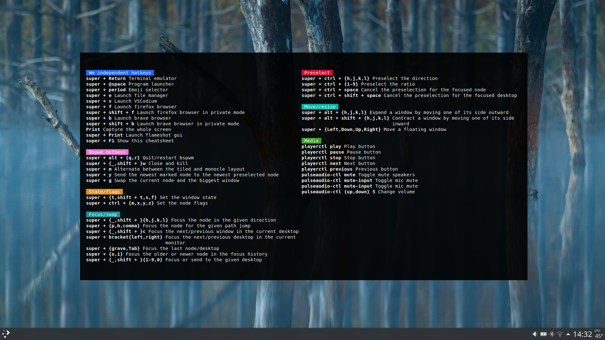

# Sxhkd Cheatsheet

This program generates a [TUI](https://en.wikipedia.org/wiki/Text-based_user_interface) cheatsheet of your [sxhkd](https://github.com/baskerville/sxhkd) configuration file.  
It was heavily inspired from [AwesomeWM](https://awesomewm.org)'s widget I saw in [this](https://youtu.be/1QQps1qTgG4?t=216) YouTube video from [Chris Titus Tech](https://christitus.com).

## Screenshots

## Feautres

-   🎨 Colors are fully customizable, with support for 24bit TrueColor and classic 16 colors palette
-   🎈 Automatically adjusts to fit the terminal window and center its content
-   💼 Works out of the box with the default sxhkd configuration (no need to edit the sxhkd config file)

## Build

1. `cmake`
1. `make`

## Usage

Run `sxhkd-cheatsheet`, passing as the last argument the path to the sxhkd configuration file.  
Use the `--help` flag to get full details.

Example: `sxhkd-cheatsheet ~/.config/sxhkd/sxhkdrc`

You can exit by pressing `q` or `esc` on your keyboard.

### Custom colors:

You can also pass one (or more) colors to use to highlight the sections using the `-c` argument.  
See `--help` for details.

## Acknowledgments

-   Arthur Sonzogni for [FTXUI](https://github.com/ArthurSonzogni/FTXUI), the library I used for displaying the results.

## License

This project is licensed under GPLv3. See the LICENSE file for more info.  

